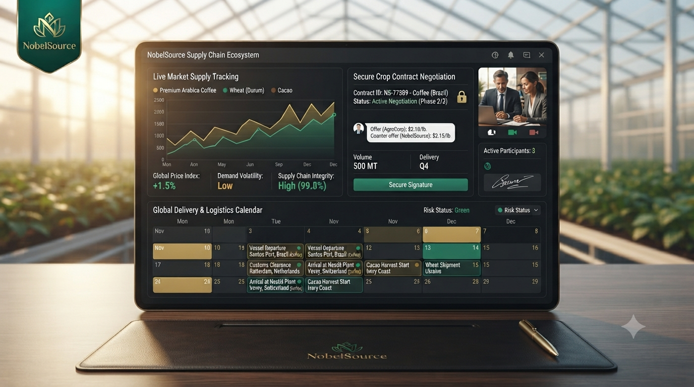
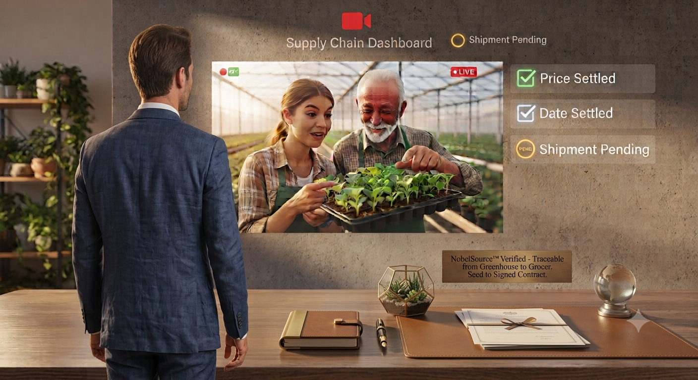

# NobelSource 🌾🤝

A B2B marketplace that connects agricultural suppliers and buyers through contracts, so farmers know there is demand before they plant.

## What I built

My graduation project. Sudden market miscommunication between suppliers and buyers can ruin farmers financially and destabilize prices. NobelSource matches real demand with production up front, using negotiation rooms and volume commitments instead of unpredictable spot trading.

## Tech Stack

- **Frontend:** React 19, Vite, TypeScript, TanStack Query, Tailwind CSS v4, Framer Motion
- **Backend:** Node.js, Express, PostgreSQL, Drizzle ORM, Socket.IO
- **Other:** Cloudinary (file storage), Bcrypt + session auth

## Key Features

- **Intent marketplace:** buyers post "We Want...", suppliers post "We Offer..."
- **Negotiation rooms:** real-time channels for agreeing on terms
- **Volume contracts:** long-term, periodic commitments instead of one-off deals
- **Logistics tracking:** shipment milestones and shared scheduling
- **Payment receipts:** upload proof of off-platform payments for tracking

## Screenshots

## Live Demo

Coming soon. <!-- add your link here once deployed -->

## What I learned

- Designing a full-stack, real-time app end to end (Socket.IO + PostgreSQL)
- Type-safe data handling with Drizzle ORM and Zod validation
- Turning a real market problem into clear product features

---

📬 shemab71@gmail.com · 💼 [LinkedIn](https://www.linkedin.com/in/shema-bruno/)
